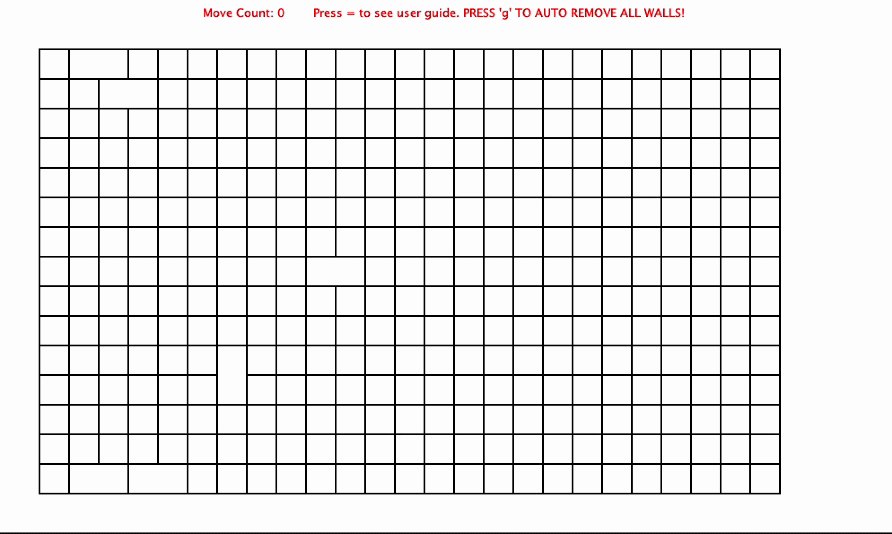
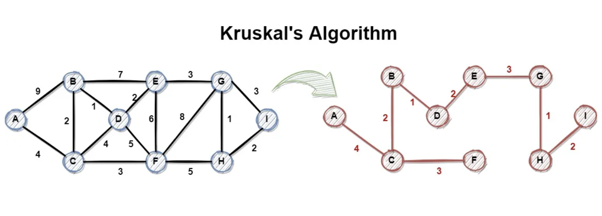
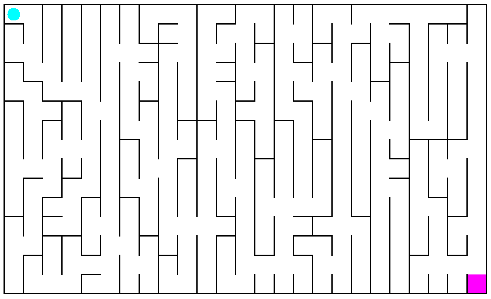
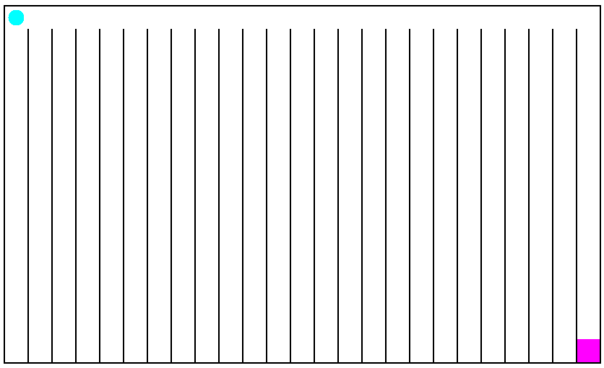
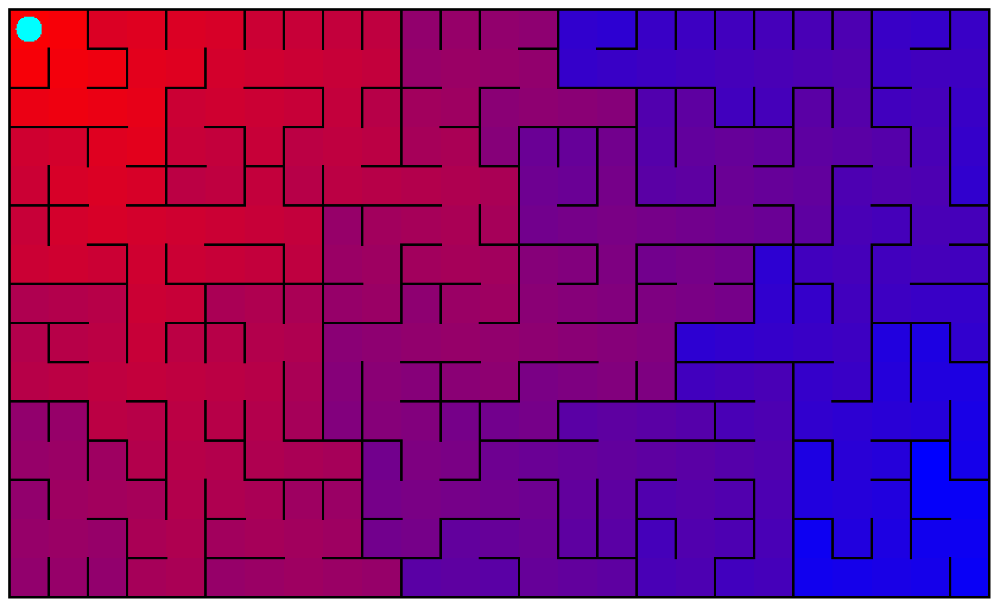
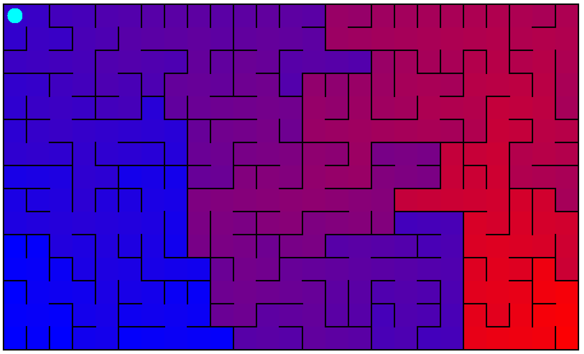
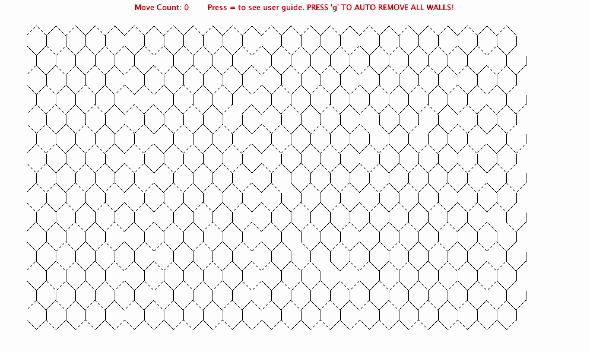

# Maze Generator and Solver

## Overview

- Constructs random mazes using Kruskal's algorithm and Union Find.
- Displays the maze and animates both depth first and breadth first search for the solution.
- Allow the user to traverse the maze manually
- Shows many different visualizations of the maze

## Skills Demonstrated

- **Algorithms**: Utilized 3 algorithms in the implementation of this project: Kruskal's Minimum Spanning tree, Depth first search, and Breadth first search.
- **Protected Object Oriented Design**: All fields in this project were final, which ensured flexible programming and mimimal dependencies when working with interconnected classes.
- **Graphs, Hashmaps, Trees, and Arraylists**: Maze was constructed and worked with as a Graph, required use of different data structures to best accomplish goals.

## Data Structure

In order to implement a mimimum spanning tree algorithm, the maze consisted of two main classes:

- Cells: Represent each square of the maze or nodes in a graph, contains fields for all 4 (or 6) edges.
- Edges: Represent the edges between cells or connections within a graph, contains fields for to and from cells as well as weight for generation.

Both cells and edges are handled by a central maze class, which has the following properties:

- A 2-dimensional ArrayList of Cells representing the maze.
- A Hashmap\<Cell, Cell> for defining groups for the union/find data structure.
- An ArrayList of Edges representing all the edges that could be in the maze.
- An ArrayList of Edges representing the edges that make up the maze.
- A Worklist for the current seach algorithm.
- A Hashmap\<Cell, Cell> that defines a the solution path cell by cell from start to finish.

## Functionality

- To Generate the maze, edges were constructed between every adjacent cell, and given a random weight. From there, the cells and edges were equivalient to nodes and connections on a graph, and kruskals algorithm could be used to find edges that would create one and only one path between every node, creating a maze. 
  
  This process consisted of splitting each cell into groups, and then combining groups with single connections until every cell was in the same group. By connecting edges with the highest weight first, the produced maze was random.
- To solve the maze, the algorithm started with a cell (the top left), and used the edges on that cell to add connected cells to a worklist. From here, cells were pulled from the worklist and processed. The only difference between breadth first and depth first search is whether the cells are pulled from the start or the end of the worklist.

## Additional Features

Because the maze generation was based on the weight of the edges, it is possible to create mazes with biases in different directions by changing the randomess of the weights. For example, below are mazes with 75% (left) and 100% (right) vertical bias on edges. (Note that even with 100% bias, there must still be some horizontal connections to make a viable maze.) 

Another added feature to this project is the ability for cells to know their distance within the maze to other cells. Below are mazes with each cell colored in a gradient from red to blue with the distance from either the start (left) or the end (right). Note that these are not just reversed maps of each other due to the nature of trees/mazes. 

Finally, the most complex addition to this project was hexagonal mazes. Because from a graph perspective hexagonal mazes are no more complex than square mazes, most of the code did not have to be changed, but many of the processes (including cells and edges) had to be abstracted to allow for the new layout.

\*This project was done in collaboration with [Zach Croft](https://www.linkedin.com/in/zachary-croft-67316b298/)\*
